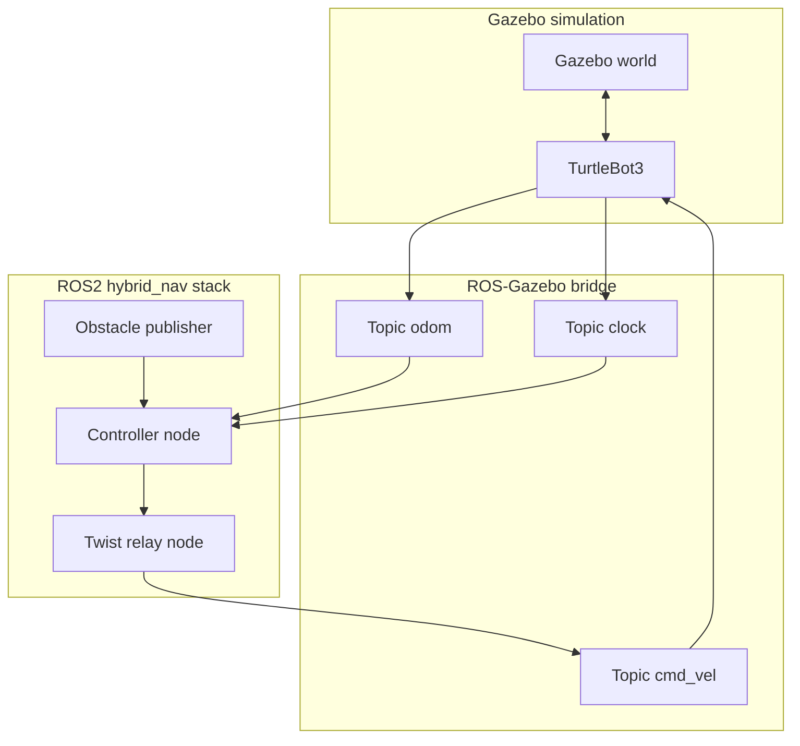

# Risk-Aware Hybrid LQR-MPC Navigation for Autonomous Systems

This repository contains the implementation of a Risk-Aware Hybrid LQR-MPC Navigation framework for autonomous systems. The framework enables safe, efficient, and robust navigation in densely cluttered environments by dynamically blending a fast, optimal Linear Quadratic Regulator (LQR) with a predictive, constraint-aware Model Predictive Controller (MPC) based on real-time spatial risk assessment.

## Project Overview

Traditional navigation systems often face a trade-off between computational efficiency and safety in complex environments. This project introduces a hybrid controller that:
- Uses **LQR** for fast, efficient trajectory tracking in safe regions.
- Seamlessly transitions to **MPC** (or Adaptive MPC) when the system detects spatial risk, utilizing a look-ahead horizon to safely navigate around obstacles.
- Dynamically adjusts the blending weights between LQR and MPC using a continuous sigmoid risk function, preventing abrupt control discontinuities.

This architecture has been thoroughly validated using Monte Carlo statistical testing and simulated in Gazebo with a differential drive robot (TurtleBot3).

## System Architecture

Data flows from Gazebo through ROS–GZ bridges, ROS 2 nodes (obstacle publisher, active controller, twist relay), and back to the simulated robot. Controllers share topics such as `/odom`, `/clock`, `/obstacles`, and `/cmd_vel` (as `TwistStamped`, then relayed as `Twist` to the bridge).



Launch **one** of: `lqr_controller_node`, `mpc_controller_node`, `adaptive_mpc_controller_node`, or `hybrid_controller_node` as `ctrlNode`. All use the same topics and twist relay to the bridge.

## References and attribution

- **Short curated list:** [REFERENCES.md](REFERENCES.md) (textbooks, anchor papers including Kong *et al.* hybrid iLQR–MPC on legged robots as the main conceptual precursor, software including adaptive-MPC reference repo).
- **Full annotated bibliography** (pillars, code module map): [docs/REFERENCES.md](docs/REFERENCES.md).
- **Adaptive MPC:** methodology context and MATLAB examples in [github.com/KohlerJohannes/Adaptive](https://github.com/KohlerJohannes/Adaptive) (Köhler, 2026); this repo’s `AdaptiveMPCController` is Python/CasADi and not a line-for-line port.

## Setup Instructions

### Option 1: Docker (Recommended)
We provide a fully configured Docker environment that supports both ROS2 Jazzy (GZ Harmonic) and ROS2 Humble (GZ Garden).

```bash
# Launch with Jazzy (Default)
docker compose up

# Launch with Humble
docker compose up humble
```
*Note for Linux users: You may need to run `xhost +local:docker` to allow Gazebo to open a GUI window.*

### Option 2: Native ROS2 Workspace
If you have ROS2 Humble or Jazzy installed natively:

1. **Install Dependencies:**
   ```bash
   make setup
   ```
2. **Build Workspace:**
   ```bash
   make build
   ```
3. **Source Workspace:**
   ```bash
   source ros2_ws/install/setup.bash
   ```

## Run Instructions

You can run the full Gazebo simulation with RViz visualization using the provided Makefile targets:

- **Hybrid Controller** (LQR + MPC blending):
  ```bash
  make run
  ```
- **Pure MPC Controller**:
  ```bash
  make run-mpc
  ```
- **Adaptive MPC Controller**:
  ```bash
  make run-adaptive
  ```
- **Pure LQR Controller**:
  ```bash
  make run-lqr
  ```

For standalone, headless Python simulations (no ROS2 or Gazebo required):
```bash
make sim
```

## Output Structure

All generated plots use **``Output/Plots/<Mode>/<path>/``** on disk (relative to the repo root): **``<path>``** is the trajectory family for LQR, Compare, and Trajectories; for MPC, Adaptive MPC, and Hybrid it is **``<trajectory>/<scenario>``** so runs with different environments do not overwrite each other.

```text
Output/
└── Plots/
    ├── LQR/
    │   └── <trajectory>/
    ├── MPC/
    │   └── <trajectory>/<scenario>/
    ├── AdaptiveMPC/
    │   └── <trajectory>/<scenario>/
    ├── Hybrid/
    │   └── <trajectory>/<scenario>/
    ├── Compare/
    │   └── <trajectory>/
    ├── Trajectories/
    │   └── <trajectory>/
    └── Evaluation/
```
*Note: Evaluation artifacts default to `Output/Plots/Evaluation/` (runners accept `--output` to override).*

## Modifying Parameters

Centralized configuration for the controllers and simulation parameters (e.g., lookahead horizon, safety margins, matrix weights) is located at:
`ros2_ws/src/hybrid_nav/config/params.yaml`

Modifications to this file will automatically apply on the next launch.
